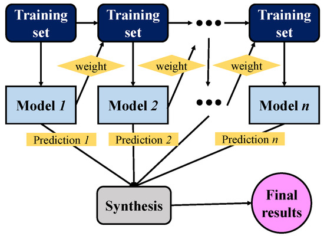

# Laporan Proyek Machine Learning - Sulistyo Chandrianto

## Domain Proyek

Domain dari proyek machine learning yang dipilih adalah kesehatan, dengan judul proyek Diagnosa Penyakit Diabetes Berdasarkan Rekam Medis

**Latar Belakang**:

- Penyakit Diabetes adalah penyakit jangka panjang yang ditandai dengan kadar gula darah tinggi. Kadar gula darah yang tinggi ini umumnya disebabkan oleh konsumsi gula yang berlebihan, pola makan yang salah serta penggunaan insulin yang tidak semestinya. Berdasarkan *International Diabetes Federation* (IDF) [[1](https://www.sciencedirect.com/science/article/pii/S0168822716300808)], diperkirakan ada sekitar 387 juta orang dengan rentang umur 20-79 tahun yang terkena penyakit diabetes di tahun 2014 dan diperkirakan akan bertambah sampai 592 juta di tahun 2035. Peningkatan jumlah orang yang terkena diabetes ini seringkali terjadi karena penyakit diabetes baru disadari setelah sudah parah. Selain itu juga, diagnosa penyakit diabetes biasanya menggunakan tes hemoglobin A1c (HbA1c) yang dilakukan oleh dokter sedangkan terkadang banyak daerah yang sulit mendapat akses medis ataupun dokter. Penyakit diabetes sendiri memiliki kemiripan pada gejala yang dialami penderitanya. Dari gejala ini memungkinkan untuk diagnosa penyakit diabetes berdasarkan rekam medis tersebut.

## Business Understanding

### Problem Statements

Berdasarkan latar belakang yang telah dipaparkan, dirumuskan permasalahan sebagai berikut:

- Bagaimana membuat model yang dapat memprediksi seorang pasien terkena penyakit diabetes berdasarkan rekam medis ?
- Apa model machine learning yang tepat dan akurat yang dapat digunakan dalam prediksi seseorang terkena penyakit diabetes ?

### Goals

Tujuan dari proyek machine learning ini adalah sebagai berikut:

- Membuat model machine learning yang dapat memprediksi seorang pasien terkena penyakit diabetes berdasarkan rekam medis.
- Memilih model machine learning yang tepat dan akurat dalam proses memprediksi apakah seorang pasien terkena penyakit diabetes atau tidak.

### Solution Statements

Dalam mencapai tujuan tersebut, dipilih beberapa model yang akan dibandingkan. Model yang dipilih biasanya digunakan dalam kasus prediksi. Berikut model-model tersebut

- KNN (K-Nearest Neighbor) adalah algoritma *supervised machine learning* yang digunakan untuk menyelesaikan permasalahan klasifikasi dan regresi. Algoritma KNN merupakan algoritma *non-parametric* yang memprediksi nilai berdasarkan kesamaan antara *data point* baru dengan *data point* yang sudah diketahui [[2]()].
- Random Forest adalah algoritma dengan kumpulan *classifier* dengan struktur tree yang termasuk dalam *ensemble classifier*. Algoritma ini memecah tiap node menggunakan bagian terbaik secara acak sehingga sebuah *tree* akan dibentuk menggunakan pemilihan fitur secara acak. Algoritma Random Forest sangat cepat dan kuat melawan *overfitting*. Selain itu algoritma Random Forest memungkinkan untuk membentuk *tree* sesuai dengan pengguna [[3](https://www.researchgate.net/profile/Oezlem-Akar/publication/272760612_Rastgele_orman_algoritmasi_kullanilarak_cok_bantli_goruntulerin_siniflandirilmasi/links/572ae07308ae057b0a079845/Rastgele-orman-algoritmasi-kullanilarak-cok-bantli-goeruentuelerin-siniflandirilmasi.pdf)].
- Adaptive Boosting adalah algoritma yang diusulkan pada tahun 1995 oleh Yoav
  Freund dan Robert Shapire sebagai metode umum untuk menghasilkan *classifier* yang kuat
  dari sekumpulan *classifier* lemah. Algoritma Adaptive Boosting mampu bekerja dengan *classifier* potensial seperti neural network, linear diskriminan dan lainnya [[4](https://www.cmi.ac.in/~madhavan/courses/dmml2022/literature/rojas-adaboost.pdf)].

## Data Understanding

Dataset yang digunakan sebagai sumber pembuatan model dalam proyek ini diambil dari [Kaggle Diabetes prediction dataset](https://www.kaggle.com/datasets/iammustafatz/diabetes-prediction-dataset). Dataset ini berisi data medis dan demografis pasien beserta status apakah pasien tersebut positif penderita diabetes. Dataset ini memiliki 100.000 baris data dan terdapat 9 kolom.

### Variabel-variabel pada Kaggle Diabetes prediction dataset adalah sebagai berikut:

- gender : jenis kelamin dari pasien (Male, Female, Other)
- age : menyatakan usia dari pasien dalam tahun dengan rentang nilai 0-80
- hypertension : menyatakan pasien mengidap hipertensi (1=pengidap hipertensi, 0= bukan pengidap hipertensi)
- heart_disease : menyatakan pasien mengidap sakit jantung (1=pengidap sakit jantung, 0= bukan pengidap sakit jantung)
- smoking_history : menyatakan sejarah rokok pasien (ever = pernah merokok, not current= tidak sedang merokok, current= perokok aktif, former=dulu perokok tapi sekarang sudah tidak, never= belum pernah merokok, no info= tidak ada informasi)
- bmi : menyatakan nilai *Body Mass Index* dari pasien, range nilai BMI di dataset ini adalah 10.16 - 71.55. Nilai BMI kurang dari 18.5 merupakan *underweight*, 18.5-24.9 merupakan berat normal, 25-29.9 merupakan *overweight*, dan lebih dari 30 merupakan obesitas.
- HbA1c_level : menyatakan nilai *Hemoglobin A1c* yaitu nilai rata-rata gula darah pasien selama 2-3 bulan lalu. Semakin tinggi nilai HbA1c_level semakin tinggi resiko pasien terkena diabetes;
- blood_glucose_level : menyatakan nilai gula darah pasien
- diabetset : menyatakan pasien mengidap diabetes (1=pengidap diabetes, 0=bukan pengidap diabetes)

### Univariate Analysis

Dilakukan proses analisa dengan teknik *univariate* EDA untuk fitur kategorikal dan fitur numerik. Pembahasan analisa dijelaskan sebagai berikut:

#### Fitur Kategorikal

Fitur kategorikal yang dipilih adalah fitur gender dan fitur smoking_history.

**Fitur gender**

Gambar 1. Visualisasi Fitur gender

Dari Gambar 1 dapat dilihat bahwa jumlah data Female lebih banyak dari data Male tetapi secara persentase perbandingan data tidak terpaut jauh yaitu masing-masing sebesar 58% dan 41%.

**Fitur smoking_history**

Gambar 2. Visualisasi Fitur smoking_history

Dari Gambar 2 dapat dilihat bahwa sebagian besar data memiliki nilai No Info dan never.

#### Fitur Numerik

Dalam melakukan analisa fitur numerik digunakan visualisasi data menggunakan histogram yang dapat dilihat dibawah ini.

Gambar 3. Histogram Fitur Numerik

Dari histogram Gambar 3 ditemukan:

- Pasien berumur 80 tahun memiliki jumlah paling banyak

### Multivariate Analysis

Dilakukan analisa multivariate EDA untuk menunjukkan hubungan antara dua variabel atau lebih. Berikut pembahasan multivariate EDA untuk fitur kategorikal maupun fitur numerik.

#### Hubungan Fitur Kategorikal

Terdapat 4 fitur kategorikal yang ada di dataset yang digunakan yaitu gender, smoking_history, hypertension dan heart_desease. Dari fitur kategorikal ini akan dilihat korelasi nya dengan fitur diabetes. Berikut tampilannya.

Gambar 4. Korelasi Fitur Kategorikal dengan Fitur diabetes

Dari Gambar 4 terlihat bahwa 

- fitur gender dan smoking_history sedikit berpengaruh terhadap fitur diabetes
- fitur hypertension dan heart_desease memiliki pengaruh banyak yang terlihat pengidap hipertensi dan sakit jantung memiliki nilai rata-rata fitur diabetes yang lebih besar

#### Hubungan Fitur Numerik

Analisa Multivariate EDA juga dilakukan untuk melihat korelasi antar fitur numerik.

Dibawah ini hasil tampilan hubungan antar fitur numerik menggunakan pairplot.

Gambar 5. Korelasi antar Fitur Numerik

Dengan menggunakan acuan fitur diabetes terlihat bahwa

- fitur HbA1c_level dan blood_glucose_level berpengaruh terhadap fitur diabetes. Semakin tinggi nilai pada sumbu x semakin tinggi juga kemungkinan pasien tersebut mengalami diabetes (nilai fitur diabetes=1)

Selain itu juga, dilakukan visualisasi korelasi antar fitur numerik menggunakan heatmap terlihat di gambar dibawah ini.

Gambar 6. Heatmap antar Fitur Numerik

Dari heatmap Gambar 6 dapat disimpulkan bahwa korelasi blood_glucose_level dan HbA1c_level memiliki nilai korelasi yang cukup tinggi. Hal ini memperkuat hasil analisa dari pairplot bahwa fitur  blood_glucose_level dan HbA1c_level berpengaruh banyak terhadap fitur diabetes.

## Data Preparation

Teknik yang digunakan dalam menyiapkan data adalah sebagai berikut:

- **Penanganan Nilai yang Hilang (*Missing Value*)**. Pada kasus dataset ini tidak ada data yang hilang sehingga tidak perlu dilakukan proses penanganan *missing value*.

- **Penangan *Outliers***. *Outliers* adalah sampel nilai yang memiliki nilai sangat jauh dari nilai yang ada di dataset. Sangat penting untuk menghilangkan *outliers* agar tidak mengganggu distribusi data latih. Pada kasus dataset ini tidak dilakukan penghapusan *outliers* karena ketika dilakukan penghapusan data *outliers* menggunakan metode IQR, nilai 1 di fitur diabetes juga ikut terhapus. Hal ini dapat dilihat pada gambar dibawah ini.

- **One-Hot-Encoding**.merupakan teknik untuk mengubah data kategorikal menjadi numerik. Teknik ini diterapkan pada fitur gender dan smoking_history.

- **Penangan Imbalance Dataset**.Pada dataset ini terjadi *imbalance* untuk jumlah fitur diabetes dimana hal ini terjadi biasanya karena dataset tidak uniform sehingga diperlukan metode *resampling* [[5](https://dl.acm.org/doi/abs/10.1145/2911451.2914722.)]. Teknik yang digunakan untuk mengatasi masalah ini adalah *Random Oversampling and Undersampling*. Perbandingan jumlah data fitur diabetes untuk nilai 0 dan 1 adalah 10:1 sehingga dilakukan *Random Oversampling and Undersampling* dengan bantuan [resample](https://scikit-learn.org/stable/modules/generated/sklearn.utils.resample.html) untuk mendapatkan perbandingan data 1:1.

- **Pembagian Data Uji dan Data Latih.**Pembagian data dilakukan dengan bantuan [train_test_split](https://scikit-learn.org/stable/modules/generated/sklearn.model_selection.train_test_split.html). Pada proyek ini dilakukan split data dengan perbandingan 95% data latih dan 5% data uji dikarenakan jumlah total data yang cukup besar.

- **Normalisasi**.Diperlukan normalisasi yaitu membuat distribusi data agar mendekati distribusi normal agar membantu data lebih mudah diolah oleh algoritma. Pada proyek ini normalisasi menggunakan teknik StandardScaler yaitu teknik yang menghasilkan distribusi data dengan rata-rata bernilai 0 dan standar deviasi bernilai 1.

## Modeling

Tahapan ini mengembangkan 3 model machine learning yaitu KNN, Random Forest dan Adaptive Boosting.

Berikut penjelasan yang digunakan di setiap model yang digunakan.

- **KNN (K-Nearest Neighbor)**. KNN bekerja dengan cara melihat kemiripan data. Algoritma KNN mengasumsikan data-data yang mirip memiliki jarak yang sama. Perhitungan jarak ini bisa dilakukan dengan rumus jarak antara dua titik. Perhitungan jarak pada proyek ini menggunakan *Minkowski Distance*. Terdapat parameter k sebagai parameter untuk nilai berapa banyak jumlah data yang diperiksa ke tetangga terdekat. Nilai parameter k yang digunakan di proyek ini adalah 15. Pemilihan nilai k=15 didapat dari mencoba-coba dengan metric MSE sebagai acuan performa model KNN.

  - **Kelebihan**
    - Mudah dalam implementasinya.
    - Memiliki sedikit *hyperparameter.*
  - **Kekurangan**
    - Tidak bekerja dengan baik untuk dataset dengan jumlah yang banyak.
    - Dataset harus dinormalisasi.
    - Tidak bekerja dengan baik untuk dataset dengan dimensi yang banyak.

- **Random Forest**.Random Forest memiliki 3 parameter yang harus ditentukan sebelum proses pelatihan model yaitu n_estimator sebagai jumlah *tree* yang digunakan kemudian parameter max_depth sebagai nilai kedalaman *tree* dan parameter random_state sebagai parameter untuk menentukan *random number generator* yang digunakan. Algoritma Random Forest terdiri dari kumpulan *tree*. Setiap *tree* akan dilatih dengan proses sampling dengan penggantian yang akan mengurangi korelasi antara *tree* sehingga data lebih independen. Prediksi akhir yang diambil adalah rata-rata prediksi dari seluruh *tree*. Nilai parameter yang digunakan di proyek ini adalah n_estimator = 50, max_depth=16, random_state=50. Tampilan cara kerja algoritma Random Forest dapat dilihat di Gambar 7.

  

  Gambar 7. Ilustrasi Cara Kerja Algoritma Random Forest

  - **Kelebihan**
    - Mengurangi resiko *overfitting.*
    - Memiliki akurasi yang tinggi dan *error rate* yang lebih rendah.
    - Memberikan hasil yang bagus di permasalahan klasifikasi.
  - **Kekurangan**
    - Memakan banyak waktu karena setiap *tree* mempunyai proses tersendiri.
    - Membutuhkan *resource* yang lebih banyak.

- **Adaptive Boosting**. Konsep dasar Adaptive Boosting adalah menggabungkan model-model lemah menjadi model yang kuat. Cara kerja algoritma Adaptive Boosting dapat dilihat pada Gambar 8.

  

  Gambar 8. Cara Kerja Algoritma Adaptive Boosting

  Pertama data latih diberikan nilai bobot yang sama kemudian dilakukan pelatihan model. Data latih yang salah dalam akan diberikan nilai bobot yang lebih tinggi dan digabungkan dengan sebagian data latih yang belum dilatih. Gabungan data ini akan membuat data latih baru yang kemudian akan dilakukan pelatihan model. Proses ini diulang sampai ditemukan akurasi yang diinginkan atau nilai kesalahan yang kecil.

  Terdapat parameter learning_rate yaitu bobot yang diterapkan di setiap *regressor* di masing-masing proses iterasi *boosting* dan random_state yaitu parameter untuk menentukan *random number generator* yang digunakan. Nilai parameter yang digunakan di proyek ini adalah learning_rate = 0.05, random_state=123

  - **Kelebihan**
    - Mampu memperbaiki akurasi *classifier* yang lemah
    - Resiko terjadi *overfitting* sangat kecil karena proses pelatihan model berjalan secara sequential dan tiap data memiliki bobot.
  - **Kekurangan**
    - Sensitif terhadap data *outlier*
    - Membutuhkan dataset yang berkualitas

## Evaluation

Metric yang digunakan untuk mengevaluasi model adalah MSE (*Mean Squared Error*). MSE menghitung rata-rata dari selisih kuadrat antara nilai prediksi dan nilai aktual. Dengan kata lain, MSE menghitung berapa rata-rata kesalahan kuadrat dalam prediksi. Semakin kecil nilai MSE semakin baik juga model tersebut dalam prediksi.

Rumus MSE

	Dengan n = jumlah dataset, yi = nilai sebenarnya , ŷi = nilai prediksi

Hasil dari MSE setiap model dapat dilihat di tabel bawah ini.

Tabel 1. Tabel Hasil MSE (*Mean Squared Error*) tiap model

|                   | train    | test     |
| ----------------- | -------- | -------- |
| KNN               | 0.030885 | 0.038796 |
| Random Forest     | 0.025811 | 0.030165 |
| Adaptive Boosting | 0.075773 | 0.077067 |

Tampilan *bar chart* tiap model untuk metrik MSE dapat dilihat dibawah ini.

Gambar 9. *Bar chart* metrik MSE

Terlihat dari Gambar 9 di atas bahwa model Random Forest memiliki nilai MSE terkecil sehingga model Random Forest dipilih sebagai model terbaik untuk melakukan diagnosa penyakit diabetes berdasarkan rekam medis pasien.

# Kesimpulan

Sesuai dengan metodologi yang sudah dilakukan sebelumnya dapat disimpulkan bahwa pembuatan model machine learning untuk diagnosa penyakit diabetes terhadap pasien berdasarkan rekam medis bisa dilakukan dengan model Random Forest sebagai model terbaik.

# Referensi

[[1](https://www.sciencedirect.com/science/article/pii/S0168822716300808)] da Rocha Fernandes, Joao, et al. "IDF Diabetes Atlas estimates of 2014 global health expenditures on diabetes." *Diabetes research and clinical practice* 117 (2016): 48-54.

[[2]()] Hart, Peter E., David G. Stork, and Richard O. Duda. *Pattern classification*. Hoboken: Wiley, 2000.

[[3](https://www.researchgate.net/profile/Oezlem-Akar/publication/272760612_Rastgele_orman_algoritmasi_kullanilarak_cok_bantli_goruntulerin_siniflandirilmasi/links/572ae07308ae057b0a079845/Rastgele-orman-algoritmasi-kullanilarak-cok-bantli-goeruentuelerin-siniflandirilmasi.pdf)] Akar, Özlem, and Oguz Güngör. "Classification of multispectral images using Random Forest algorithm." *Journal of Geodesy and Geoinformation* 1.2 (2012): 105-112.

[[4](https://www.cmi.ac.in/~madhavan/courses/dmml2022/literature/rojas-adaboost.pdf)] Rojas, Raúl. "AdaBoost and the super bowl of classifiers a tutorial introduction to adaptive boosting." *Freie University, Berlin, Tech. Rep* 1.1 (2009): 1-6.

[[5](https://dl.acm.org/doi/abs/10.1145/2911451.2914722)] Moreo, Alejandro, Andrea Esuli, and Fabrizio Sebastiani. "Distributional random oversampling for imbalanced text classification." *Proceedings of the 39th International ACM SIGIR conference on Research and Development in Information Retrieval*. 2016.
