# Laporan Proyek Machine Learning - Sulistyo Chandrianto

## Domain Proyek

Domain dari proyek machine learning yang di pilih adalah kesahatan, dengan judul proyek Diagnosa Penyakit Diabetes Berdasarkan Rekam Medis

**Latar Belakang**:

- Penyakit Diabetes adalah penyakit jangka panjang yang ditandai dengan kadar gula darah tinggi. Kadar gula darah yang tinggi ini umumnya disebabkan oleh konsumsi gula yang berlebihan, pola makan yang salah serta penggunaan insulin yang tidak semestinya. Berdasarkan *International Diabetes Federation* (IDF) [[1](https://diabetesatlas.org/atlas/tenth-edition/)], diperkirakan ada sekitar 537 juta orang dengan rentang umur 20-79 tahun yang terkena penyakit diabetes di tahun 2021 dan diperkirakan akan bertambah sampai 643 juta di tahun 2030. Peningkatan jumlah orang yang terkena diabetes ini seringkali terjadi karena penyakit diabetes baru di sadari setelah sudah parah. Selain itu juga, diagnosa penyakit diabetes biasanya menggunakan tes hemoglobin A1c (HbA1c) yang di lakukan oleh dokter sedangkan terkadang banyak daerah yang sulit mendapat akses medis ataupun dokter. Penyakit diabetes sendiri memiliki kemiripan pada gejala yang dialami penderitanya. Dari gejala ini memungkinkan untuk diagnosa penyakit diabetes berdasarkan rekam medis tersebut.

## Business Understanding

### Problem Statements

Berdasarkan latar belakang yang telah dipaparkan, dirumuskan permasalahan sebagai berikut:

- Bagaimana membuat model yang dapat memprediksi seorang pasien terkena penyakit diabetes berdasarkan rekam medis ?
- Apa model machine learning yang tepat dan akurat yang dapat digunakan dalam prediksi seseorang terkena penyakit diabetes ?

### Goals

Tujuan dari proyek machine learning ini adalah sebagai berikut:

- Membuat model machine learning yang dapat memprediksi seorang pasien terkena penyakit diabetes berdasarkan rekam medis.
- Memilih model machine learning yang tepat dan akurat dalam proses memprediksi apakah seorang pasien terkena penyakit diabetes atau tidak.

### Solution Statements

Dalam mencapai tujuan tersebut, dipilih beberapa model yang akan dibandingkan. Model yang dipilih biasanya digunakan dalam kasus prediksi. Berikut model-model tersebut

- KNN (K-Nearest Neighbor) adalah algoritma *supervised machine learning* yang digunakan untuk menyelesaikan permasalahan klasifikasi dan regresi. Algoritma KNN merupakan algortima *non-parametric* yang memprediksi nilai berdasarkan kesamaan antara *data point* baru dengan *data point* yang sudah di ketahui [[2]()].
- Random Forest adalah algoritma *supervised learning*. Konsep algoritma Random Forest didasarkan pada *ensemble learning* yaitu mengintergrasikan beberapa pengklasifikasi untuk memecahkan masalah yang kompleks dan meningkatkan kinerja model. Algoritma Random Forest juga dapat dipahami sebagai sebuah *classifier* yang berisi beberapa *decision tree* pada berbagai subset dari dataset yang diberikan dan mengambil rata-rata dari setiap *decision tree* untuk meningkatkan akurasi prediksi dari dataset tersebut [[3](https://www.turing.com/kb/random-forest-algorithm)].
- Adaptive Boosting adalah algoritma *supervise ensemble learning* yang dikembangkan oleh Freund dan Schapire pada tahun 1995. Algoritma ini membantu mengurangi nilai kesalahan untuk semua algoritma klasifikasi dengan cara secara berurut mengubah *classifier* yang lemah menjadi kuat. Hal ini bisa dilakukan dengan *sequential weight adjustments*, *individual voting powers* dan penjumlahan bobot *classifier* final [[4](https://towardsdatascience.com/adaptive-boosting-a-stepwise-explanation-of-the-algorithm-50b75c3729c1)].

## Data Understanding

Dataset yang digunakan sebagai sumber pembuatan model dalam proyek ini diambil dari [Kaggle Diabetes prediction dataset](https://www.kaggle.com/datasets/iammustafatz/diabetes-prediction-dataset). Dataset ini berisi data medis dan demografis pasien beserta status apakah pasien tersebut positif penderita diabetes. Dataset ini memiliki 100.000 baris data dan terdapat 9 kolom.

### Variabel-variabel pada Kaggle Diabetes prediction dataset adalah sebagai berikut:

- gender : jenis kelamin dari pasien (Male, Female, Other)
- age : menyatakan usia dari pasien dalam tahun dengan rentang nilai 0-80
- hypertension : menyatakan pasien mengidap hipertensi (1=pengidap hipertensi, 0= bukan pengidap hipertensi)
- heart_disease : menyatakan pasien mengidap sakit jantung (1=pengidap sakit jantung, 0= bukan pengidap sakit jantung)
- smoking_history : menyatakan sejarah rokok pasien (ever = pernah merokok, not current= tidak sedang merokok, current= perokok aktif, former=dulu perokok tapi sekarang sudah tidak, never= belum pernah merokok, no info= tidak ada informasi)
- bmi : menyatakan nilai *Body Mass Index* dari pasien, range nilai BMI di dataset ini adalah 10.16 - 71.55. Nilai BMI kurang dari 18.5 merupakan *underweight*, 18.5-24.9 merupakan berat normal, 25-29.9 merupakan *overweight*, dan lebih dari 30 merupakan obesitas.
- HbA1c_level : menyatakan nilai *Hemoglobin A1c* yaitu nilai rata-rata gula darah pasien selama 2-3 bulan lalu. Semakin tinggi nilai HbA1c_level semakin tinggi resiko pasien terkena diabetes;
- blood_glucose_level : menyatakan nilai gula darah pasien
- diabetset : menyatakan pasien mengidap diabetes (1=pengidap diabetes, 0=bukan pengidap diabetes)

### Univariate Analysis

Dilakukan proses analisa dengan teknik *univariate* EDA untuk fitur kategorikal dan fitur numerik. Pembahasan analisa dapat dilihat di sebagai berikut :

#### Fitur Kategorikal

Fitur kategorikal yang dipilih adalah fitur gender dan fitur smoking_history.

**Fitur gender**

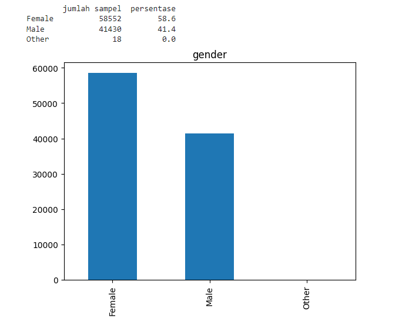

Dari grafik diatas dapat dilihat bahwa jumlah data Female lebih banyak dari data Male tetapi secara presentase perbandingan data tidak terpaut jauh yaitu masing-masing sebesar 58% dan 41%.

**Fitur smoking_history**

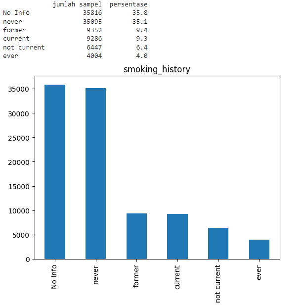

Dari grafik diatas dapat dilihat bahwa sebagian besar data memiliki nilai No Info dan never.

#### Fitur Numerik

Dalam melakukan analisa fitur numerik digunakan visualisasi data menggunakan histogram yang dapat dilihat dibawah ini.

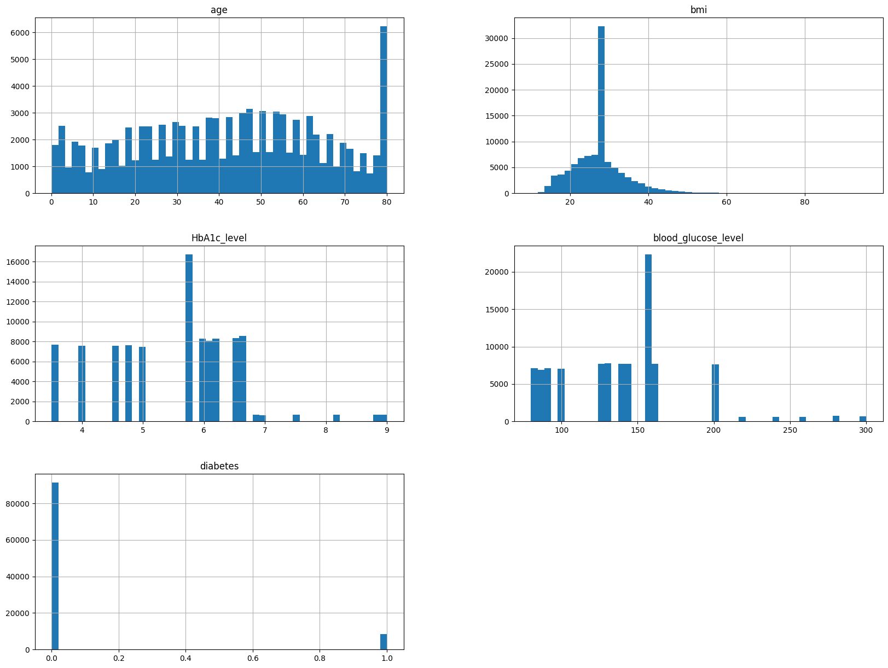

Dari histogram diatas ditemukan:

- Pasien berumur 80 tahun memiliki jumlah paling banyak

### Multivariate Analysis

Dilakukan analisa multivariate EDA untuk menunjukkan hubungan antara dua variabel atau lebih. Berikut pembahasan multivariate EDA untuk fitur kategorikal maupun fitur numerik.

#### Hubungan Fitur Kategorikal

Terdapat 4 fitur kategorikal yang ada di dataset yang digunakan yaitu gender, smoking_history, hypertension dan heart_desease. Dari fitur kategorikal ini akan dilihat korelasi nya dengan fitur diabetes. Berikut tampilannya.

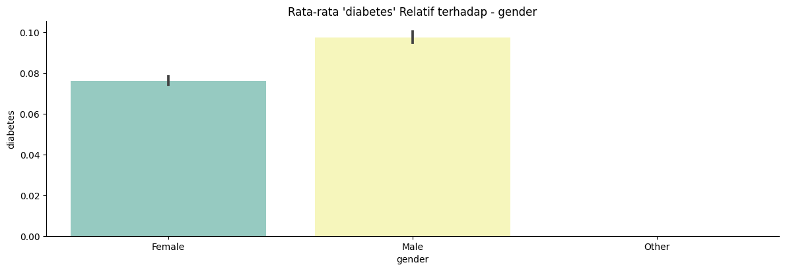

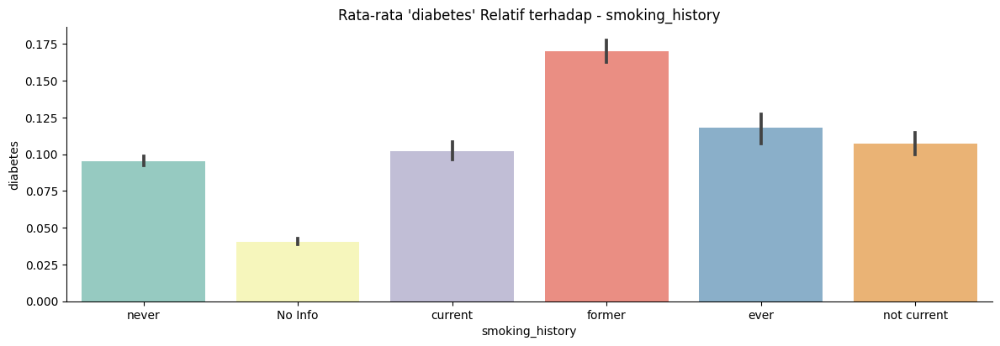

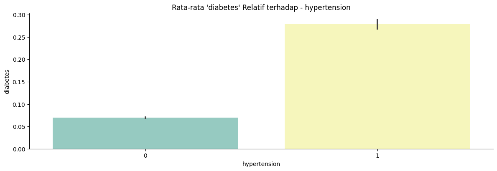

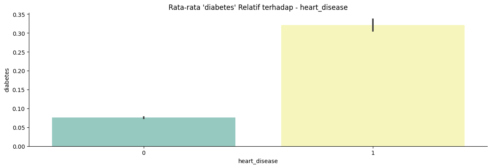

Dari gambar-gambar diatas terlihat bahwa 

- fitur gender dan smoking_history sedikit berpengaruh terhadap fitur diabetes
- fitur hypertension dan heart_desease memiliki pengaruh banyak yang terlihat pengidap hipertensi dan sakit jantung memiliki nilai rata-rata fitur diabetes yang lebih besar

#### Hubungan Fitur Numerik

Analisa Multivariate EDA juga dilakukan untuk melihat korelasi antar fitur numerik.

Dibawah ini hasil tampilan hubungan antar fitur numerik menggunakan pairplot.

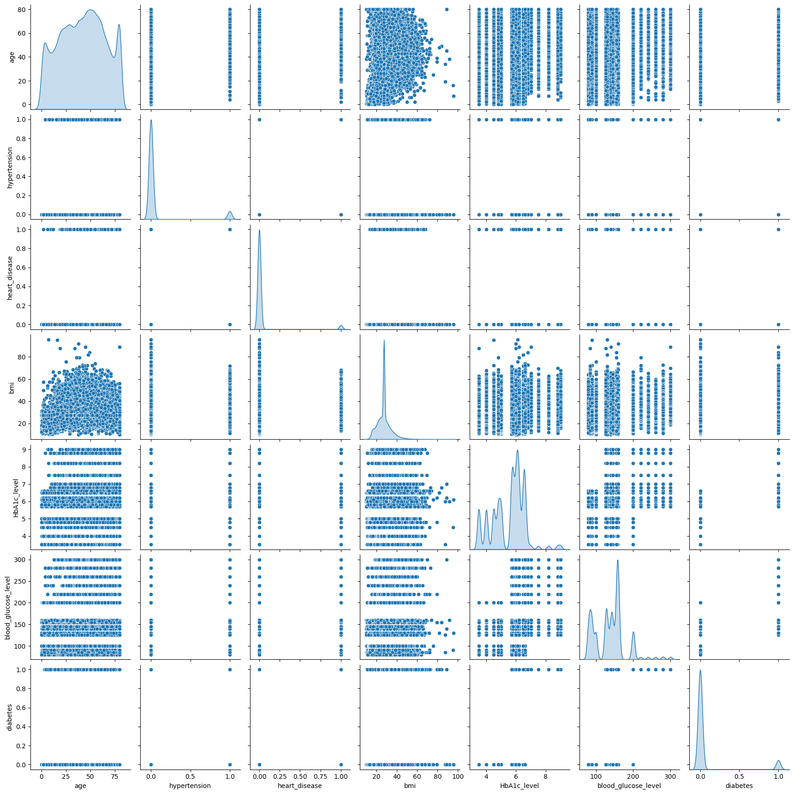

Dengan menggunakan acuan fitur diabetes terlihat bahwa

- fitur HbA1c_level dan blood_glucose_level berpengaruh terhadap fitur diabetes. Semakin tinggi nilai pada sumbu x semakin tinggi juga kemungkinan pasien tersebut mengalami diabetes (nilai fitur diabetes=1)

Selain itu juga, dilakukan visualisasi korelasi antar fitur numerik menggunakan heatmap terlihat di gambar dibawah ini.

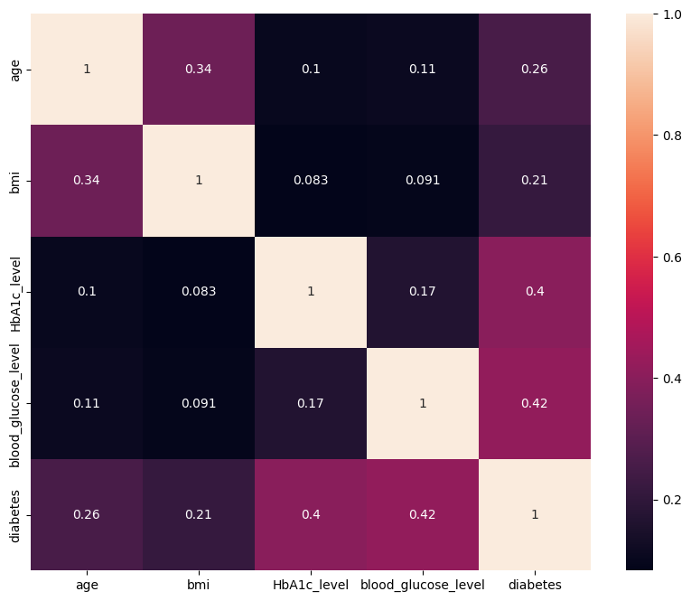

Dari heatmap diatas dapat disimpulkan bahwa korelasi blood_glucose_level dan HbA1c_level memiliki nilai korelasi yang cukup tinggi. Hal ini memperkuat hasil analisa dari pairplot bahwa fitur  blood_glucose_level dan HbA1c_level berpengaruh banyak terhadap fitur diabetes.

## Data Preparation

Teknik yang digunakan dalam menyipakan data adalah sebagai berikut:

- **Penanganan Nilai yang Hilang (Missing Value)**. Pada kasus dataset ini tidak ada data yang hilang sehingga tidak perlu dilakukan proses penanganan missing value.

- **Penangan Outliers**. Outliers adalah sampel nilai yang memiliki nilai sangat jauh dari nilai yang ada di dataset. Sangat penting untuk menghilangkan outliers agar tidak menggangu distribusi data latih. Di kasus dataset ini tidak dilakukan penghapusan outliers karena ketika dilakukan penghapusan data outliers menggunakan metode IQR, nilai 1 di fitur diabetes juga ikut terhapus. Hal ini dapat dilihat pada gambar dibawah ini.

  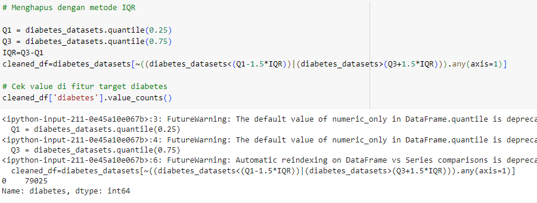

- **One-Hot-Encoding**.merupakan teknik untuk mengubah data kategorikal menjadi numerik. Teknik ini diterapkan di fitur gender dan smoking_history.
- **Penangan Imbalance Dataset**.Pada dataset ini terjadi *imbalance* untuk jumlah fitur diabetes dimana hal ini dapat menyebabkan prediksi akan mengabaikan bagian minoritas data dari fitur tersebut [[5](https://machinelearningmastery.com/random-oversampling-and-undersampling-for-imbalanced-classification/#:~:text=One%20approach%20to%20addressing%20the,the%20minority%20class%2C%20called%20oversampling.)]. Teknik yang digunakan untuk mengatasi masalah ini adalah *Random Oversampling and Undersampling*. Perbandingan jumlah data fitur diabetes untuk nilai 0 dan 1 adalah 10:1 sehingga dilakukan *Random Oversampling and Undersampling* dengan bantuan [resample](https://scikit-learn.org/stable/modules/generated/sklearn.utils.resample.html) untuk mendapatkan perbadingan data 1:1.
- **Pembagian Data Uji dan Data Latih.**Split data dilakukan dengan bantuan [train_test_split](https://scikit-learn.org/stable/modules/generated/sklearn.model_selection.train_test_split.html). Pada proyek ini dilakukan split data dengan perbandingan 95% data latih dan 5% data uji dikarenakan jumlah total data yang cukup besar.
- **Normalisasi**.Diperlukan normalisasi yaitu membuat distribusi data agar mendekati distribusi normal agar membantu data lebih mudah diolah oleh algoritma. Pada proyek ini normalisasi menggunakan teknik StandarScaler yaitu teknik yang menghasilkan distribusi data dengan rata-rata bernilai 0 dan standar deviasi bernilai 1.

## Modeling

Tahapan ini mengembangkan 3 model machine learning yaitu KNN, Random Forest dan Adaptive Boosting.

Berikut parameter-parameter yang digunakan di setiap model yang digunakan.

- **KNN (K-Nearest Neighbor)**.Terdapat parameter k sebagai parameter untuk nilai berapa banyak memeriksa ke tetangga terdekat. Nilai parameter k yang digunakan di proyek ini adalah 15
- **Random Forest**.Terdapat parameter n_estimator yaitu jumlah *tree* yang digunakan kemudian parameter max_depth yaitu kedalaman *tree* dan parameter random_state yaitu parameter untuk menentukan *random number generator* yang digunakan. Nilai parameter yang digunakan di proyek ini adalah n_estimator = 50, max_depth=16, random_state=50
- **Adaptive Boosting**.Terdapat parameter learning_rate yaitu bobot yang diterapkan di setiap regressor di masing-masing proses iterasi boosting dan random_state yaitu parameter untuk menentukan *random number generator* yang digunakan. Nilai parameter yang digunakan di proyek ini adalah learning_rate = 0.05, random_state=123

## Evaluation

Metric yang digunakan untuk mengevaluasi model adalah MSE (*Mean Squared Error*). MSE menghitung rata-rata dari selisih kuadrat antara nilai prediksi dan nilai aktual. Dengan kata lain, MSE menghitung berapa rata-rata kesalahan kuadrat dalam prediksi. Semakin kecil nilai MSE semakin baik juga model tersebut dalam prediksi.

Rumus MSE

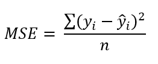

​	Dengan n = jumlah dataset, yi = nilai sebenarnya , ŷi = nilai prediksi

Hasil dari MSE setiap model dapat dilihat di tabel bawah ini.

|                   | train    | test     |
| ----------------- | -------- | -------- |
| KNN               | 0.030885 | 0.038796 |
| Random Forest     | 0.025811 | 0.030165 |
| Adaptive Boosting | 0.075773 | 0.077067 |

Tampilan *bar chart* tiap model untuk metrik MSE dapat dilihat dibawah ini.

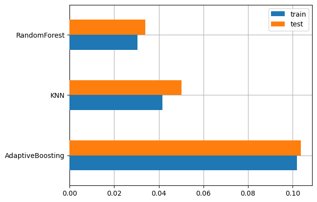

Terlihat dari *chart* diatas bahwa model Random Forest memiliki nilai MSE terkecil sehingga model Random Forest dipilih sebagi model terbaik untuk melakukan diagnosa penyakit diabetes berdasarkan rekam medis pasien.

# Kesimpulan

Sesuai dengan metodologi yang sudah dilakukan sebelumnya dapat disimpulkan bahwa pembuatan model machine learning untuk diagnoas penyakit diabetes terhadap pasien berdasarkan rekam medis bisa dilakukan dengan model Random Forest sebagai model terbaik.

# Referensi

[[1](https://diabetesatlas.org/atlas/tenth-edition/)] IDF, IDF Diabetes Atlas 10th edition.IDF.2021.https://diabetesatlas.org/atlas/tenth-edition/

[[2]()] R. O. Duda, P. E. Hart and D. G. Stork, “Pattern Classification,” 2nd Edition, Wiley-Interscience, New York, 2000.

[[3](https://www.turing.com/kb/random-forest-algorithm)]Chaudhary, M.Random Forest Algorithm - How It Works & Why It’s So Effective.TURING.https://www.turing.com/kb/random-forest-algorithm

[[4](https://towardsdatascience.com/adaptive-boosting-a-stepwise-explanation-of-the-algorithm-50b75c3729c1)] Brugger, B.Adaptive Boosting: A stepwise Explanation of the Algorithm.Towards Data Science.2021.https://towardsdatascience.com/adaptive-boosting-a-stepwise-explanation-of-the-algorithm-50b75c3729c1

[[5]()] Brownlee, J.Random Oversampling and Undersampling for Imbalanced Classification.Machine Learning Mastery.2021.https://machinelearningmastery.com/random-oversampling-and-undersampling-for-imbalanced-classification/#:~:text=One%20approach%20to%20addressing%20the,the%20minority%20class%2C%20called%20oversampling.
